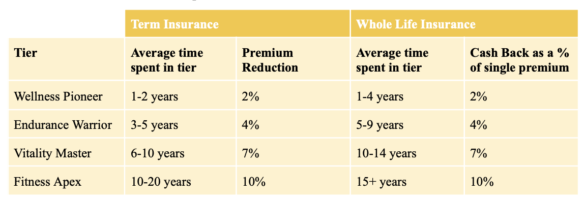

# ACTL4001 SOA Student Research Case Study Challenge
## SuperLife Saves Lives

**Members**: Arnav Bharadwaj, Danushan Dayaparan, Alex Lu, Catherine Lye and Peter Zhou.

### Program Overview

SuperLife’s main objectives are to encourage healthier lifestyles and decrease expected mortality through the fitness tracker and health screening incentives. By improving the product’s marketability and competitiveness, SuperLife aims to secure a stronger foothold in the life insurance industry by bolstering sales and adding economic value to the company.

### Program Incentives
_Free fitness tracker_
> A complimentary fitness tracker will be provided, allowing a convenient system to track fitness such as physical activity, daily step count, heart rate, blood pressure and BMI. As the cost of purchasing a fitness tracker may discourage policy holders from tracking fitness, offering a free device incentivises removes this barrier to participation.

_Tiered Reward System_
> Policyholders are able to earn Super points as they continually track fitness and achieve specific fitness and health goals. Fitness goals can include a 10,000 daily step count, healthy eating, weight loss, limit on alcohol and tobacco use and health goals include attending regular health screenings. As a person accumulates Super points, they are able to advance in tier status and receive premium reductions for term insureds or cash backs for whole life insureds. Inactivity for more than 4 weeks may result in loss of points, incentivising consistent tracking.

_Referral Incentive_
> Participants can earn additional Super points by referring others to join the program. If the referred individuals stay enrolled for at least 12 months, the referrer receives extra points. This encourages current participants to promote Superlife and the program to others, increasing life insurance sales.

_Leaderboard Recognition_
> A leaderboard showcasing notable weekly point earners can serve as a form of recognition and motivation. High performing individuals can be highlighted, encouraging friendly competition and inspiring others to increase participation.

(**Please refer to our project report for more information**)

### File Summary

**Setup**
> Foundation code for future EDA 

**Death_data_EDA** 
> Investigation into what variables are most significant for policyholders that have died.

**Full_data_EDA**
> Investigation into what variables are most significant for entire policyholder pool. 

**Lapse_EDA**
> Investigation into what variables are most significant for policyholders that have lapsed.

**Mortality_Savings_Projections**
> Forecasts of mortality savings (and profits) from the implementation of various intervention strategies.

**Pricing Model**
> Model used to determine the premiums for an whole life and term insurance with chosen intervention strategies. 

